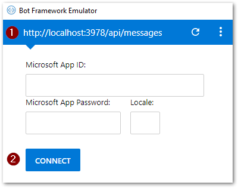

# TeamsBot  :zap: 
> *Chat bot for automating things in team collaboration tools like Slack, Teams*</br>

### Table of Contents
* [Prerequisites](#prerequisites)
* [Installation](#installation)
* [Usage](#usage)
### Prerequisites
 * [NodeJs](https://nodejs.org/en/)
 * [BotFramework-Emulator](https://github.com/Microsoft/BotFramework-Emulator/releases)
### Installation
Clone the repository
```console
$ git clone https://github.com/jagdish7908/TeamsBot.git && cd TeamsBot
```
Install dependencies
```console
$ npm install
```
### Usage
```console
$ node app.js
```
Test the bot in local environment, install and open BotFramework-Emulator</br>

